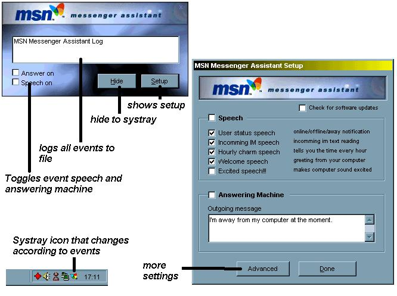



## MSN Messenger Assistant

### Description

Adds extra features to MSN Messenger including:

an answering machine, and it reads out conversation text and other alerts in a computer voice + lots more.

Requires MSN Messenger & Microsoft Speech Agent (available from http://www.wilsonr1.karoo.net/MSSpeech.exe or the Microsoft web-site.)
 
### More Info
 

             |
---                |---
**Submitted On**   |2001-07-27 16:21:08
**By**             |[Chris Wilson UK](https://github.com/Planet-Source-Code/PSCIndex/blob/master/ByAuthor/chris-wilson-uk.md)
**Level**          |Intermediate
**User Rating**    |3.9 (39 globes from 10 users)
**Compatibility**  |VB 6\.0
**Category**       |[Complete Applications](https://github.com/Planet-Source-Code/PSCIndex/blob/master/ByCategory/complete-applications__1-27.md)
**World**          |[Visual Basic](https://github.com/Planet-Source-Code/PSCIndex/blob/master/ByWorld/visual-basic.md)
**Archive File**   |[MSN Messen236077272001\.zip](https://github.com/Planet-Source-Code/chris-wilson-uk-msn-messenger-assistant__1-25561/archive/master.zip)

